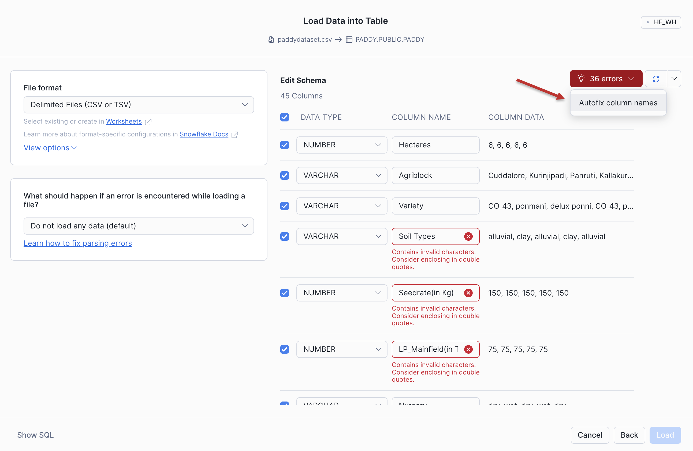

author: Sarah Sdao
id: build-and-deploy-lm-dashboard-with-posit-team-and-cortex
summary: Build and deploy an interactive LLM-powered dashboard using the Posit Team Native App and Snowflake Cortex
categories: getting-started,data-science-&-ml,partner-integrations
environments: web
status: Published
feedback link: https://github.com/Snowflake-Labs/sfguides/issues
tags: Getting Started, Data Science, Posit, Python, LLM, AI
language: en

# Build and Deploy an Interactive LLM-Powered Dashboard with the Posit Team Native App and Snowflake Cortex AI

## Overview

In this guide, we'll use the Posit Team Native App to build an interactive dashboard that lets users explore agricultural data using natural language queries powered by Snowflake Cortex AI. You'll use Positron Assistant to develop a Shiny application with the `querychat` and `chatlas` packages, then deploy it to Posit Connect with one-click publishing.

By the end of this guide, you'll have a fully functional dashboard where users can ask questions like "How do wind speed, direction, and humidity influence paddy (rice seed) growth?" or "Which factors have the strongest influence on paddy yield?" and get instant visualizations and insights.

### What You Will Learn

- How to securely connect to your Snowflake databases from Posit Workbench and the Positron Pro IDE
- How to leverage Cortex AI using Positron Assistant to build a Shiny application
- How to create an LLM-powered chat interface for data exploration
- How to deploy the dashboard to Posit Connect with one-click publishing

### What You Will Build

- A Snowflake database containing agriculture data
- An interactive Shiny dashboard with natural language query capabilities built using Cortex AI
- A published application accessible to your team on Posit Connect

### Prerequisites

- A [Snowflake account](https://signup.snowflake.com/?utm_source=snowflake-devrel&utm_medium=developer-guides&utm_cta=developer-guides) with Cortex AI enabled
- Appropriate access to create warehouses, databases, and schemas in Snowflake. This is typically the `sysadmin` role
- Access to the [Posit Team Native App](https://www.snowflake.com/en/developers/guides/analyze-data-with-python-using-posit-team/#:~:text=Pro%20from%20the-,Posit%20Team%20Native%20App,-.%20An%20administrator%20with). An administrator with the `accountadmin` role can provide these for you
- Familiarity with SQL and Python

## Setup

In this section, we'll set up a database and warehouse in Snowflake, then load agriculture data that we'll query through our LLM dashboard.

### Create Database and Warehouse

For this analysis, we'll use the [Paddy dataset](https://archive.ics.uci.edu/dataset/1186/paddy+dataset) from UC Irvine.

In Snowsight, open a SQL worksheet (**+** > **SQL File**). Then, paste in and run the following code, which creates the necessary database, schema, and warehouse. Make sure to change the role to your own role.

```sql
USE ROLE SYSADMIN; -- Replace with your actual Snowflake role (e.g., sysadmin)

CREATE OR REPLACE DATABASE PADDY_DATA;

CREATE OR REPLACE SCHEMA PUBLIC;

CREATE OR REPLACE WAREHOUSE PADDY_WH
    WAREHOUSE_SIZE = 'xsmall'
    WAREHOUSE_TYPE = 'standard'
    AUTO_SUSPEND = 60
    AUTO_RESUME = TRUE
    INITIALLY_SUSPENDED = TRUE;
```

These commands create a database called `PADDY_DATA` with a `PUBLIC` schema and a small warehouse called `PADDY_WH`.

### Load Data into Snowflake

Now we'll create a table to hold the Paddy dataset.

1. Download the dataset from UCI:
   [https://archive.ics.uci.edu/dataset/1186/paddy+dataset](https://archive.ics.uci.edu/dataset/1186/paddy+dataset)

2. Unzip the downloaded file.

    - You should now see a file named `paddydataset.csv`. We’ll upload this `csv` file into Snowflake.

3. In Snowsight, click **Ingestion** > **Load Data into a Table**.

4. Click **Browse** and choose `paddydataset.csv` from your machine.

5. Under **Select or create a database and schema**, choose:
   - **Database:** `PADDY`
   - **Schema:** `PUBLIC`

6. Under **Select or create a table**:
   - Ensure **+ Create new table** is selected.
   - For **Name**, enter `PADDY`.

7. Click **Next**, then **Load**.
    - This dataset has some invalid characters in the column names. Luckily, you can use Snowflake's **Autofix** function to clean all 36 column names: click the red button indicating the **36 errors** and then click **Autofix column names**. This adds quotation marks to the invalid column names.



### Confirm the database, data, and schema

You should now be able to see the agriculture data in Snowsight. Navigate to **Horizon Catalog** > **Catalog** > **Database Explorer** > `PADDY` > `PUBLIC` > `Tables`. You should now see the `PADDY` table.

<!-- TODO: Take screenshot and save as assets/verify-data.png

Screenshot should show: Query results showing agriculture data rows
-->

## Launch Posit Workbench from the Posit Team Native App

We can now start exploring the data using Workbench. You can find Workbench within the Posit Team Native App, and use it to connect to your database.

### Step 1: Get the Posit Team Native App from the Snowflake Marketplace

- In Snowsight, click on **Marketplace**. If the Posit Team Native App is not already installed, search for "Posit Team" and then click **Get**.

  

- You might be asked to validate your email address.
- Choose a name for the App.

### Step 2: Open the Posit Team Native App from Snowsight

Please note that your administrator must first [install and configure](https://docs.posit.co/partnerships/snowflake/posit-team/) the Posit Team Native App--and Posit Workbench within it--before you can follow the remaining steps.

Once your administrator has installed and configred the Posit Team Native App, in Snowsight, navigate to **Horizon Catalog** > **Catalog** > **Installed Apps** > the Posit Team Native App. If you do not see the Posit Team Native App listed, ask your Snowflake account administrator for access to the app.

After clicking on the app, you will see the Posit Team Native App page.

Click **Launch app**.


### Step 3: Open Posit Workbench from the Posit Team Native App

From the Posit Team Native App, click **Posit Workbench**.


You might be prompted to first log in to Snowflake using your regular credentials or authentication method.

## Create a Positron Pro Session

Posit Workbench provides several IDEs, including Positron Pro, VS Code, RStudio Pro, and JupyterLab. For this analysis, we will use Positron,
the next-generation data science IDE built for Python and R. It combines the power of a full-featured IDE with interactive data science tools for Python and R.

### Step 1: New Session

Within Posit Workbench, click **+ New Session** to launch a new session.


### Step 2: Select an IDE

When prompted, select Positron Pro. You can optionally give your session a unique name.


#### Step 3: Log into your Snowflake account

Next, connect to your Snowflake account from within Posit Workbench.
Under **Session Credentials**, click the button with the Snowflake icon to sign in to Snowflake. Follow any sign in prompts.


#### Step 4: Launch Positron Pro

Under **Environment**, enter at least 2.5 GB of RAM in the **Memory (GB)** field.

Then, click **Launch** to launch Positron Pro. If desired, you can check the **Auto-join sesssion** option to automatically open the IDE when the session is ready.


You will now be able to work with your Snowflake data in Positron Pro. Since the IDE is provided
by Posit Workbench within the Posit Team Native App, your entire analysis will occur securely within Snowflake.

## Get the Shiny Extension

The Shiny VS Code extension supports the development of Shiny apps in Positron. The Shiny Extension is included automatically in Positron as a [bootstrapped extension](https://positron.posit.co/extensions.html#bootstrapped-extensions).

We'll want Positron Assistant to be able to create a Shiny app to make and share our LLM dashboard, so first we need to make sure we have it installed and enabled:

1. Open the Positron Extensions view: on the right-hand side of Positron Pro, click the Extensions icon in the activity bar to open the Extensions Marketplace.

2. Search for "Shiny" to find the Shiny extension.


3. Verify that you have the Shiny extension:
  - If it is already installed and enabled, you will see a wheel icon.
  - If it is not already installed, click **Install**.
  - If you cannot install it yourself or you find that the extestion is disabled, ask your administrator for acccess.

For more information, see the [Shiny extension documentation](https://open-vsx.org/extension/posit/shiny).

## Access this Guide's Materials

This guide will walk you through the steps contained in <https://github.com/posit-dev/snowflake-posit-build-deploy-LLM-dashboard>. To follow along, clone the repository by following the steps below.

1. Open your home folder:

   - Press `Ctrl/Cmd+Shift+P` to open the Command Palette.
   - Type "File: Open Folder", and press `enter`.
   - Navigate to your home directory and click **OK**.

2. Clone the [GitHub repo](https://github.com/posit-dev/snowflake-posit-build-deploy-LLM-dashboard/) by running the following command in a terminal:

   ```bash
   git clone https://github.com/posit-dev/snowflake-posit-build-deploy-LLM-dashboard/
   ```

   > If you don't already see a terminal open, open the Command Palette (`Ctrl/Cmd+Shift+P`), then select **Terminal: Create New Terminal** to open one.

   > Note: This guide uses HTTPS for git authentication. Standard git authentication procedures apply.

3. Open the cloned repository folder:

   - Press `Ctrl/Cmd+Shift+P` to open the Command Palette.
   - Select **File: Open Folder**.
   - Navigate to `snowflake-posit-build-deploy-LLM-dashboard` and click **OK**.

### Explore Quarto

Before we dive into the steps in the repository, let's first discuss Quarto, since we've documented the initial steps to connect to our data in a Quarto (`.qmd`) document, [quarto.qmd](https://github.com/posit-dev/snowflake-posit-build-deploy-LLM-dashboard/blob/main/quarto.qmd).

[Quarto](https://quarto.org/)
is an open-source publishing system that makes it easy to create
[data products](https://quarto.org/docs/guide/) such as
[documents](https://quarto.org/docs/output-formats/html-basics.html),
[presentations](https://quarto.org/docs/presentations/),
[dashboards](https://quarto.org/docs/dashboards/),
[websites](https://quarto.org/docs/websites/),
and
[books](https://quarto.org/docs/books/). It is available out-of-the-box with Positron Pro and allows data scientists to interweave all of their code, results, output, and prose text into a single literate programming document. This way everything travels together as a reproducible data product.

A Quarto document can be thought of as a regular markdown document,
but with the ability to run code chunks.

You can run any of the code chunks by clicking the `Run Cell` button above the chunk in Positron Pro.

<!-- TODO - take new screenshot of run chunk

-->

To render and preview the entire document, click the `Preview` button
or run `quarto preview quarto.qmd` from the terminal.


This will run all the code in the document from top to bottom and
generate an HTML file, by default, for you to view and share. This is especially helpful for creating multiple plots and other static content.

Learn more about Quarto here: <https://quarto.org/>,
and the documentation for all the various Quarto outputs here: <https://quarto.org/docs/guide/>.
Quarto works with Python, R, and Javascript Observable code out-of-the box, and is a great tool to communicate your data science analyses.

## Create a Virtual Environment

Before we can run any code, we need to set up our Python virtual environment.

1. Open the Command Palette (`Cmd/Ctrl+Shift+P`), then search for and select **Python: Create Environment**.

2. Choose `Venv` to create a `.venv` virtual environment.

3. Select the Python version you want to use.

4. When prompted to **Select dependencies to install**, choose the `requirements.txt` file from the cloned GitHub repo.

   - This creates the virtual environment with the necessary dependencies. Positron activates the virtual environment automatically.
   - If Positron does not activate the virtual environment automatically, open the terminal and run `source .venv/bin/activate`.

## Connect to Snowflake Data

Now that we have our Positron Pro session started with the necessary extensions and dependencies, we can connect to our data in Snowflake.

Open the `quarto.qmd` file from `snowflake-posit-build-deploy-LLM-dashboard`. You can now use the **Run Cell** button to run the Python code directly in the Quarto document.

The code below uses `ibis`, which lets you describe queries in Python. This system:

1. Keeps our data in the database, saving memory in the Python session.
2. Pushes computations to the database, saving compute in the Python session.
3. Evaluates queries lazily, saving compute in the database.

We don't need to manage the process, it happens automatically behind the scenes.

```python
# Import necessary libraries
import snowflake.connector
import ibis
import pandas as pd

# Connect to Snowflake using Workbench Managed Credentials
# Posit Workbench automatically handles secure authentication
# to your Snowflake account via 'connection_name="workbench"'.
con = snowflake.connector.connect(
    connection_name="workbench",
    warehouse="PADDY_WH",
    database="PADDY_DATA",
    schema="PUBLIC"
)

# Use Ibis for a Pythonic way to interact with Snowflake data.
# Ibis translates Python operations into SQL queries, which are
# then executed efficiently in Snowflake.
ibiscon = ibis.snowflake.from_connection(con, create_object_udfs=False)

paddy = ibiscon.table("PADDY")

print("Successfully established secure connection to Snowflake!")
```

We have now used Workbench and Python to connect to our Paddy database and table, all securely within Snowflake.

## Chat with Positron Assistant using Cortex AI

Since we can use natural language to interact with our data via Positron Assistant, we don't need to write any additional SQL queries or data manipulation code. Positron Assistant will handle that for us based on our natural language prompts.

To stat a chat with Positron Assistant, click on the Positron Assistant icon in the toolbar:


You can select your model based on what you have available via Cortex AI. This example will use Claude Haiku 4.5

### Clean Data

As we noticed earlier, this dataset has some inconsistencies in its column names. Let's prompt Positron Assistant to clean up some of this first. Enter this prompt:

> Rename the column names

### Create a Dashboard using Shiny

- Ask Positron Assistant to create a Dashboard using Shiny, chatlas, and querychat

> Let's create an interactive LLM-powered dashboard with Shiny, querychat, and chatlas that will allow users to ask natural language questions to analyze the data in the Paddy table.
>Help me build an LLM-powered dashboard with Shiny, querychat, and chatlas that will let users ask natural language questions to explore data in the heart_failure table. I want to be able to ask questions like, "What factors are the most associated with increased risk of mortality after heart failure?"

## Deploy to Posit Connect

Now that your dashboard works locally, let's deploy it to Posit Connect so your team can access it.

### Configure Connect Publishing

In Positron, open the command palette (Cmd/Ctrl+Shift+P) and search for "Publish to Connect". If this is your first time publishing, you'll need to configure your Connect server.

Click the "Add Server" button and enter:
- **Server URL**: Your Posit Connect server address (e.g., `https://connect.your-company.com`)
- **API Key**: Generate an API key from your Connect account settings

<!-- TODO: Take screenshot and save as assets/add_server.png

Screenshot should show: The Add Server dialog in Positron with server URL and API key fields
-->

### Publish Your Dashboard

With your `app.py` file open, click the "Publish" button in the top right corner of Positron, or use the command palette to run "Publish Content".

Select the files to include:
- [x] app.py
- [x] config.py
- [ ] .env (do not publish credential files)

Choose your publishing options:
- **Title**: Agriculture Data Explorer
- **Access**: Select who should have access (e.g., "All Users" or specific groups)
- **Environment Variables**: Add `SNOWFLAKE_USER` and `SNOWFLAKE_PASSWORD` using Connect's secure environment variable storage

Click **Publish** to deploy your dashboard to Connect.

<!-- TODO: Take screenshot and save as assets/publish_dialog.png

Screenshot should show: The publish dialog with file selection and deployment options
-->

### Access Your Published Dashboard

Once publishing completes, Positron will provide a URL to your deployed application. The URL will look like:

```
https://connect.your-company.com/content/12345/
```

Click the link to open your dashboard. You can now share this URL with your team, and they can interact with the climate data using natural language queries.

<!-- TODO: Take screenshot and save as assets/deployed_app.png

Screenshot should show: The published dashboard running on Connect with the Connect URL visible
-->

> **Note:** Your dashboard will automatically reconnect to Snowflake using the environment variables you configured in Connect. Make sure your Snowflake credentials have appropriate permissions for end users to query the data.


## Conclusion And Resources

In this guide, you built a complete LLM-powered dashboard for exploring agriculture data. You set up a Snowflake database, developed a Shiny application using Positron Assistant with cthe `chatlas` and `querychat` packages, and deployed the dashboard to Posit Connect where your team can access it.

This pattern of combining Snowflake's data warehouse with Cortex AI and Posit's publishing platform creates powerful, accessible analytics applications that anyone can use through natural language.

### What You Learned


### Resources

- **Snowflake Cortex AI Documentation**: [Cortex AI Functions](https://docs.snowflake.com/en/user-guide/snowflake-cortex/llm-functions)
- **Positron**: [Positron Documentation](https://positron.posit.co/)
- **`chatlas` Package**: [Documentation](https://posit-dev.github.io/chatlas/)
- **`querychat` Package**: [Documentation](https://posit-dev.github.io/querychat/py/index.html)
- **Shiny**: [Documentation](https://shiny.posit.co/)
- **Posit Workbench**: [User Guide](https://docs.posit.co/ide/server-pro/user/)
- **Posit Connect**: [User Guide](https://docs.posit.co/connect/user/)
- **Paddy Dataset**: [Dataset from UC Irvine](https://archive.ics.uci.edu/dataset/1186/paddy+dataset)
- **Related Guides**: [Analyze Data with Python Using Posit Team](https://quickstarts.snowflake.com/guide/analyze-data-with-python-using-posit-team/)
